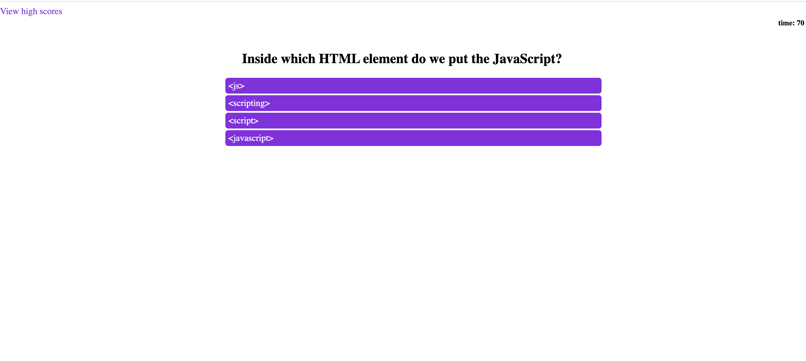

# code-quiz
This project was designed as a homework assignment for my coding bootcamp.

## Challenge's criteria
The goal was to build a timed code quiz with multiple choices questions.
I wrote all the HTML, CSS and JavaScript code.

When the app is opened , the user will face an introduction to the game.

When the 'start button' is clicked, the user is presented with the first question and the time starts running.
When the questions is answered, the user is presented with another question.
If the answer is correct, the user scores 10 points.
If the answers is wrong, 10 seconds is subtracted from the clock.
When all the questions are answered or the timer reaches 0, the game is over.
When the game is over, the user can save their initials and score.

